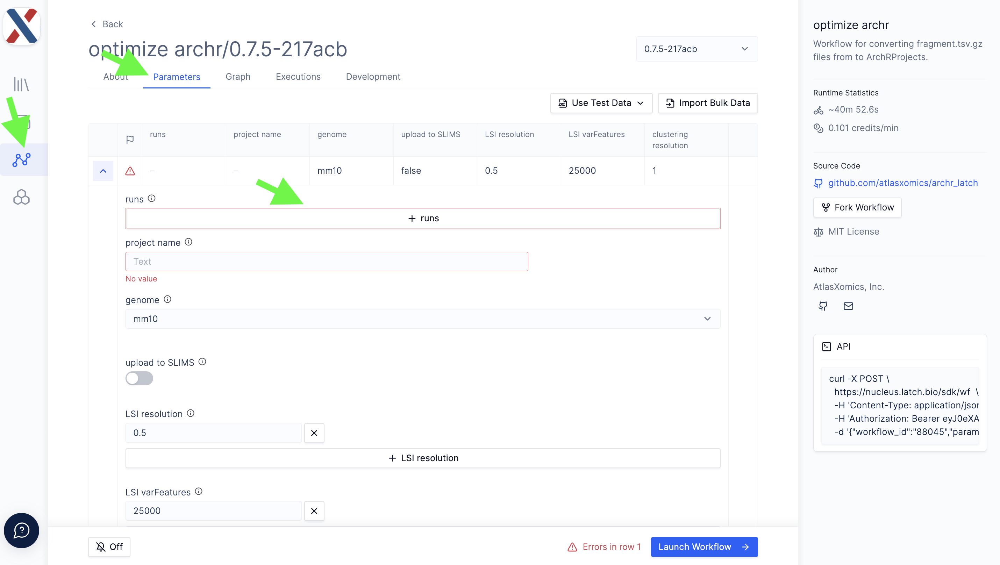
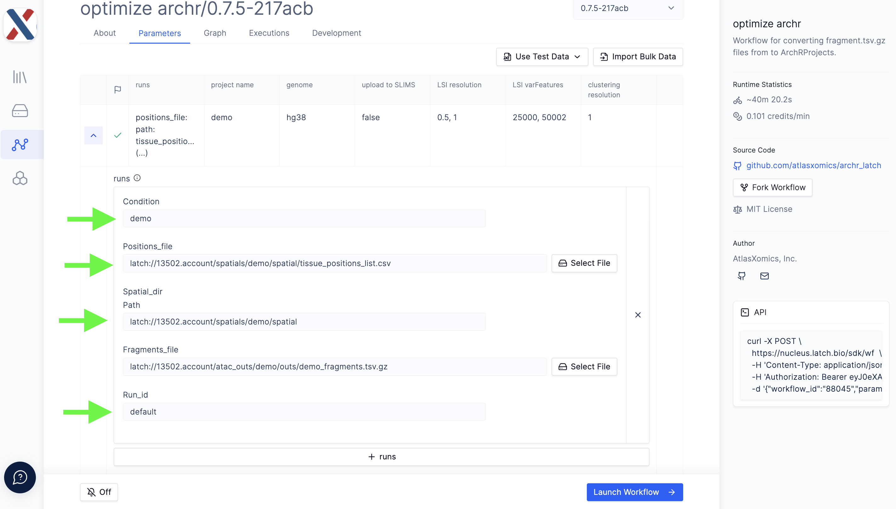
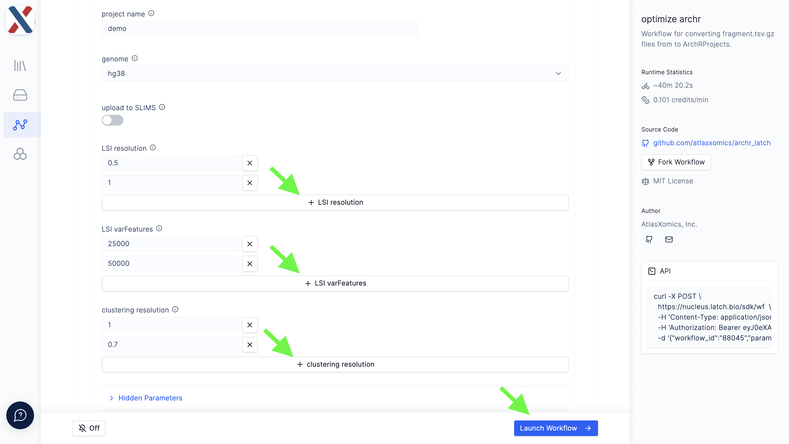

# create ArchRProject

    

 
 

**create ArchRProject** is a [latch.bio](https://latch.bio/) workflow for generating R objects and data for downstream analysis of epigenomic [DBiT-seq](https://www.nature.com/articles/s41586-022-05094-1) experiments.  Provided fragments from a single-cell ATAC-seq preprocessing and alignment workflow and spatial information, **create ArchRProjectr** performs the heavy computational steps of ArchR and Seurat and returns files that can be easily input into custom scripts for more neuanced analysis without the need to perform intensive computation.

The workflow utilizes [ArchR](https://www.archrproject.com/articles/Articles/tutorial.html) to perform epigenomic single-cell analysis and [Seurat](https://satijalab.org/seurat/) to spatially align the data.  The workflow can take data from either a single tissue-sample analyzed via DBiT-seq or multiple tissue-samples; in ATX parlance, tissue-samples analyzed via DBIT-seq are termed 'Runs'.  All Runs input to **create ArchRProject** are merged into a single ArchRProject for analysis.  

## Inputs
All input files for **create ArchRProject** must be on the latch.bio [file system](https://wiki.latch.bio/wiki/data/overview).  Each run in the workflow takes the following parameters,

* [fragments.tsv.gz file](https://support.10xgenomics.com/single-cell-atac/software/pipelines/latest/output/fragments): A BED-like, tab-delimited file in which each row contains an ATAC-seq fragment

* [tissue_positions_list.csv](https://docs.atlasxomics.com/projects/AtlasXbrowser/en/latest/SpatialFolder.html): A comma-separated file in which each row contains a unique barcode, an indicator for whether the tixel is 'on-tissue' (1, 0), and a row/column index

* [Spatial folder](https://docs.atlasxomics.com/projects/AtlasXbrowser/en/latest/SpatialFolder.html): A directory containing tissue images and experiment metadata

* Run ID: An identifier for the run

* Condition (_optional_):  An experimental Condition descriptor (ie. 'control', 'diseased')

Individual runs are batched in a Project with the following global parameters,

* Project Name: A name for the output folder

* Genome: A reference genome to be used for alignment

* Upload to SLIMS _(ATX-internal only)_: A T/F toggle for whether to push QC results to LIMS

* LSI resolution: A decimal value used as input to the `clusterParams` parameter of the `addIterativeLSI` function in [ArchR](https://www.archrproject.com/reference/addIterativeLSI.html);

* LSI varFeatures: An integer used as input to the `varFeatures` parameter of the `addIterativeLSI` function in [ArchR](https://www.archrproject.com/reference/addIterativeLSI.html);

* clustering resolution: A decimal value used as input to the `resolution` parameter of the `addClusters` function in [ArchR](https://www.archrproject.com/reference/addClusters.html).

> The Project also takes a series of single-value parameters that can be found under the 'Hidden Parameters' dropdown; these parameters are less commonly varied inputs to ArchR functions.

## Running the workflow (_in progress_)

The **create ArchRProject** workflow can be found in the [Workflows](https://wiki.latch.bio/workflows/overview) module in your latch.bio workspace. For access to an ATX-collaborator workspace, please contact your AtlasXomics Support Scientist or email support@atlasxomics.com.  See [here](https://wiki.latch.bio/workflows/overview) for general instructions for running workflows in latch.bio.

1. Navigate to the **optimize archr** workflow in the Workflows module in your latch.bio workspace.  Ensure you are on the 'Parameters' tab of the workflow.

    

2. To add Runs to the Project, select the '+ runs' icon.  Add values for the Run parameters described above; repeat for each Run in the Project.

    

3. Scroll to the bottom of the page and input values for global project parameters.

    

4. Click the 'Hidden Parameters' button and change the global parameters as needed.

5. Click the 'Launch Workflow' button on the bottom-right of the parameters page.  This will automatically navigate you to the Executions tab of the workflow.

6. From the Executions tab, you can view the status of the launched workflow.  Once the workflow has completed running, the status will change to 'Succeeded'; if the workflow has the status 'Failed', please contact an AtlasXomics Support Scientist.  You can click on the workflow execution to view a more granular workflow status and see output logs.

7. Workflow outputs are loaded into the latch.bio [Data module](https://wiki.latch.bio/wiki/data/overview) in the `ArchRProjects` directory.

## Outputs (_in progress_)

Outputs from **create ArchRProject** are loaded into latch.bio [Data module](https://wiki.latch.bio/wiki/data/overview) in the `ArchRProjects` directory.

* ArchRProject/
* SeuratObj.rds
* SeuratObjMotif.rds
* UMAPHarmony.csv
* enrichMotifs_clusters.rds
* enrichMotifs_sample.rds
* enrichMotifs_treatment.rds
* genes_per_cluster_hm.csv
* genes_per_sample_hm.csv
* genes_per_treatment_hm.csv
* inpMarkers.txt
* inpMarkers_motif.txt
* markersGS_clusters.rds
* markersGS_sample.rds
* markersGS_treatment.rds
* motif_per_cluster_hm.csv
* motif_per_sample_hm.csv
* motif_per_treatment_hm.csv
* req_genes1.csv
* req_genes2.csv
* req_genes3.csv
* req_motifs1.csv
* req_motifs2.csv
* req_motifs3.csv
* seqlogo.rds

## Next Steps

Analysis can be performed locally or in a latch.bio [Pod](https://wiki.latch.bio/wiki/pods/overview).  For access to ATX-specific Pods, please contact your AtlasXomics Support Scientist.  

Output from **create ArchRProject** can be provided to the **atlasShiny** workflow to create input for a DBiT-seq-specific R Shiny App.  For access to this workflow and app, please contact your AtlasXomics Support Scientist.
 

## Support
Questions? Comments?  Contact support@atlasxomics.com or post in AtlasXomics [Discord](https://discord.com/channels/1004748539827597413/1005222888384770108).
